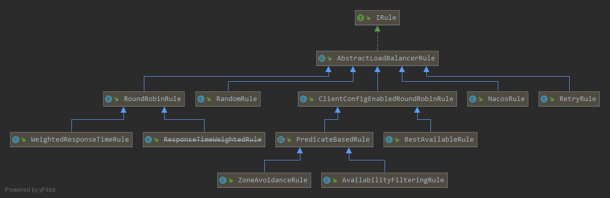

# ribbon

- [ribbon git](https://github.com/taeyangee/ribbon)
- 功能: 客户端负载均衡
- 特性
	- Load balancing
	- Fault tolerance ： Q:没看到？？
	- Multiple protocol (HTTP, TCP, UDP) support in an asynchronous and reactive model (在transport包，略过)
	- Caching and batching
- 包结构
	- ribbon: 总包
	- ribbon-loadbalancer: 最主要的包，负载均衡相关的API及其实现都在这里
	- ribbon-eureka: 基于Eureka client实现了LB API
	- ribbon-transport: ribbon提供的有负载能力的通信组件。不用看，spc里头，ribbon是配合restTemplate用的
	- ribbon-httpclient: 同上，不用看了
	- ribbon-example: 不看
	- ribbon-core: 配置相关API、常见工具类等 

# 关键组件 - ILoadBalancer
- 功能：至少持有一组Server，负责选取一个Server

#### 关键类 - AbstractLoadBalancer

- AbstractLoadBalancer，把server分成三组： 全部、在线的，不在线的

#### 关键类 - BaseBanlancer

- ILoadBalancer的基本实现，
- 关键成员
  - 配置：IClientConfig，初始化时传入
  - 核心管理对象：allServerList、upServerList
  - LB指标：LoadBalancerStats，是很多IRule做实例选择的依据，[戳我：LB都有哪些指标](https://blog.csdn.net/luanlouis/article/details/83060310)
  - ping任务：PingRuner
  - 监听器：List<ServerListChangeListener>  、 List<ServerStatusChangeListener>

- 关键流程 - 初始化
  - 入口：构造函数
  - 配置server选择器：IRule
  - 启动定时器：PingTask，默认周期10s，内部调用IPing、IPingStrategy
  - 初始化LB指标：LoadBalancerStats
- 关键流程  - ping探活， 详见IPingStrategy接口
- 关键流程 -  选择服务实例，详见IRule接口

#### 关键类 - DynamicServerListLoadBalancer
- 功能
  - servers可以来自动态数据
  - 有Filter基础设施，支持按照特定规则遴选server
- 关键成员 
  - ServerList<T> serverListImpl：从动态数据源拉取实例信息。默认实现是 DiscoveryEnabledNIWSServerList ， 整合了ek
  - ServerListUpdater serverListUpdater：配合serverListImpl做实例信息更新动作的触发
    - 默认实现是PollingServiceListUpdater,一个定时空壳，配合updateAction使用
- 关键流程 - 初始化
  - 复写了initWithNiwsConfig， 做了serverListUpdater的启动
- 关键流程 -  从ek-client获取注册表信息
  - 入口：updateListOfServers
  - serverListImpl.getUpdatedListOfServers(); /* 从动态源中拿到实例列表*/
  - filter.getFilteredListOfServers(servers); /* 过滤：根据规则，屏蔽掉一些不要的server*/
  - setServersList：更新ribbon的服务实例表

#### 关键类 - serverList

- 功能：配合DynamicServerListLoadBalancer完成服务实例的动态拉取
- 类体系
  - AbstractServerList：骨架类
  - DiscoveryEnabledNIWSServerList：基于ek-client实现的ServerList，入口函数：obtainServersViaDiscovery
  - DomainExtractingServerList：一个装饰器类，干了什么并不重要

#### 关键类 - ServerListUpdater

- 功能：serverList的调度类
- 体系
  - PollingServerListUpdater：定时调度
  - EurekaNotificationServerListUpdater：基于ek-client监听基于的serviceList的更新器

#### 关键结构 - ilb接口内容构成 

#### 关键结构 - rb+ek

#### 关键流程 - rb+ek

# 关键组件 - IRule

- 功能：协助LoadBalancer接口完成服务实例选择
- 关键API：public Server choose(Object key)

#### 类体系

- AbstractLoadBalancerRule：提供了ILoadBalancer的get/set
- RandomRule：随机调一个实例
- RoundRobinRule：轮训调一个实例，关键方法：incrementAndGetModulo
- WeightedResponseTimeRule：
  - 根据响应时间优劣，给server赋予不同权重，基于权重选择server
  - 没有足够信息支持， 就回退成RoundRobinRule
  - 关键流程：
    - serverWeight的定时计算
    - 基于serverWeight做server选取

- PredicateBasedRule
  -  一个框架Rule,把真正的选择逻辑延迟到子类，子类实现getPredicate方法
  - AvailabilityFilteringRule
    - PredicateBasedRule的子类
    - 委托AvailabilityPredicate，根据注册中心对server的负载统计做判定，是否选择该server
      - 是否故障，即断路器是否生效已断开
      - 实例的并发请求数大于阈值，默认值为$2^{31}$ - 1，该配置我们可通过参数`..ActiveConnectionsLimit`来修改
  - ZoneAvoidanceRule
    - PredicateBasedRule的子类，略
- BestAvailableRule
  - 基于LoadBalancerStats，会过滤掉故障的实例，并找出并发请求数最小的一个，所以该策略的特性是选出最空闲的实例
- NacosRule
  - 从nacos注册中心，选取一组serverlist， 随机调一个可用的

# 关键组件 - IPing、IPingStrategy

IPingStrategy：定义如何ping ILoadBalancer里头所有的server

- 默认实现：SerialPingStrategy，顺序ping

IPing：定义如何ping 一个server

- AbstractLoadBalancerPing：实现了通用的lb set/get
- NIWSDiscoveryPing: 注册中心识别改实例状态为UP，就算是ping通了
- DummyPing：always true

