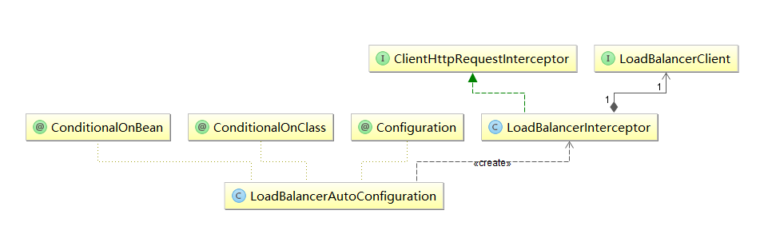

# 参考

[【Ribbon】源码解析（下）](https://juejin.cn/post/6974743338670882823)

[Spring Cloud- Ribbon设计原理](https://blog.csdn.net/luanlouis/article/details/83060310)

# 代码示例

```java
@Configuration
public class RestConfig {

    @LoadBalanced
    @Bean
    RestTemplate restTemplate() {
        return new RestTemplate();
    }
}

@RestController
@RequestMapping("/hello")
public class HelloController {

    @Resource
    RestTemplate restTemplate;

    @GetMapping("/rest")
    public String helloFromRest() {
        return restTemplate.getForObject("http://EK-CLIENT/hello", String.class);
    }

}

```


# 整体概述


搞定以下问题即可：这里主要看`如何发起一个真正的网络请求？`，其他看上一篇就好

- ribbon 如何获取服务注册列表？
- 获得注册表后，如何持续更新？
- 默认负载均衡算法如何选择一个 server？
- 如何发起一个真正的网络请求？
- ping 服务检查服务实例是否存活且有效？

# 流程：LB如何介入到Rest template

简述：rb实现了一个RestTemplate拦截器。初始化流程看类图想想就知道了



关键类 - LoadBalancerInterceptor

- 通过实现spc的ClientHttpRequestInterceptor接口，整合到sp-web-client体系中

- 具体来说ClientHttpRequestInterceptor是resttemplate提供的扩展点
- restTemplate的拦截器入口：InterceptingClientHttpRequest#InterceptingRequestExecution#execute

关键类 - RibbonLoadBalancerClient

- ribbon对 spc的LoadBalancerClient接口的实现， 整合到spc-client-loadbalance体系中
- LoadBalancerClient接口：定义在`spring-cloud-commons-2.2.5.RELEASE.jar`
- **RibbonLoadBalancerClient**实现类，在`spring-cloud-netflix-ribbon-2.2.5.RELEASE.jar`

关键结构：ribbon各种实例在spc bean容器中的结构图，一个client对应有一个context容器


# 流程：如何发起一个真正的网络请求

- spc-web-client体系 vs spc-client-lb体系
  - LoadBalancerRequest、ClientHttpResponse、ClientHttpRequest这块比较绕：这里spc玩了个套娃。整体上看，spc-web-client体系包裹spc-client-lb体系，**RibbonLoadBalancerClient**在内部介入，完成实例选择，并构建ClientHttpRequest返回给spc-web-client体系
- 整体流程

